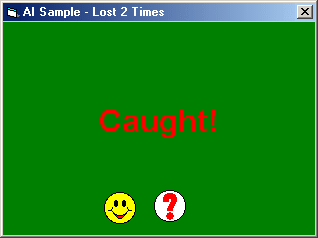



## AI Tutorail

### Description

This is an AI tutorail. It will teach you how to make stuff walk normally to you instead of going directly towards you. It also has a following feature that will chase you in a different way ( like say: There is a curvy road. The police is chasing you. If you used AIChase, the police will cut through the grass, while AIFollow will cause the police to follow you run on the curvy road.) Please vote for me, and leave comments.
 
### More Info
 

             |
---                |---
**Submitted On**   |2001-06-21 14:48:14
**By**             |[excelblue \(Mark Lu\)](https://github.com/Planet-Source-Code/PSCIndex/blob/master/ByAuthor/excelblue-mark-lu.md)
**Level**          |Beginner
**User Rating**    |4.7 (14 globes from 3 users)
**Compatibility**  |VB 5\.0, VB 6\.0
**Category**       |[Games](https://github.com/Planet-Source-Code/PSCIndex/blob/master/ByCategory/games__1-38.md)
**World**          |[Visual Basic](https://github.com/Planet-Source-Code/PSCIndex/blob/master/ByWorld/visual-basic.md)
**Archive File**   |[AI Tutorai214716212001\.zip](https://github.com/Planet-Source-Code/excelblue-mark-lu-ai-tutorail__1-24295/archive/master.zip)

